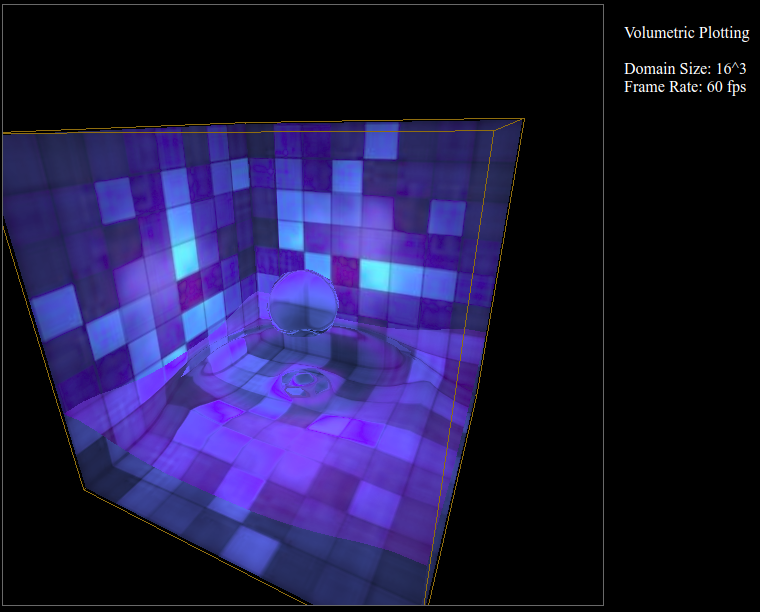

# Web-App for rendering liquids

Web-application for visualising the dynamics of liquids taking
refraction between gas-liquid interfaces into account. The
rendering is done via ray-tracing and the calculation
is performed on the GPU, ie. implemented as shader programs.

## Details

The dynamics of liquids such as water are often simulated utilizing
lattice methods. One method particularily popular is the Lattice Bolzmann
Method (See for example [Link](https://www10.cs.fau.de/publications/papers/2004/Thuerey_VMV04.pdf)).
In lattice methods each cell of the lattice is either filled, empty or partially
filled. Consequently, cells that are partially filled define the interface
between the liquid and the gas (eg. air) and light rays passing through
the interface will be deflected due to the different refraction index of the
liquid and gas.
The *fragement shader* program in this project traces the rays passing
through the 3D lattice and calculated the refraction of the rays when
crossing gas-liquid interaces. 

## Image

